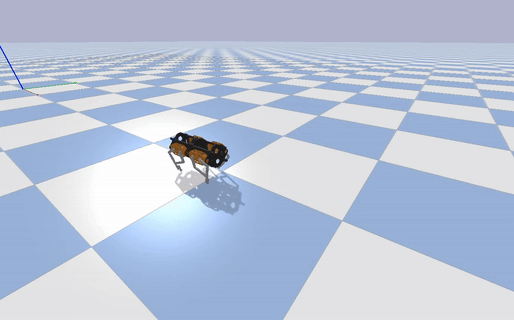
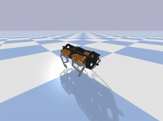
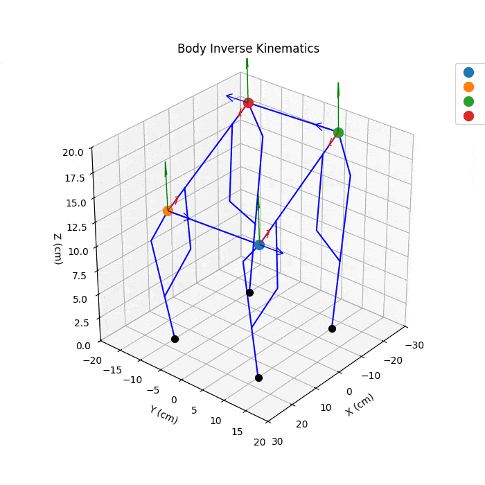

# Quadson: A Quadruped Robot Control Framework

A comprehensive control framework for the Quadson quadruped robot, implementing kinematic algorithms, locomotion control, and deep reinforcement learning for stable and adaptive walking.

## Overview

Quadson is a quadruped robot platform that combines classical kinematics with deep reinforcement learning to achieve robust locomotion. This project includes:

- **Forward & Inverse Kinematics**: Precise control of leg positions and orientations
- **Differential Kinematics**: Smooth velocity control using numerical Jacobian computation
- **Body Kinematics**: Coordinate transformations for body pose control
- **Locomotion Controller**: Multi-gait support (walk, trot, pace, bound, gallop)
- **Deep RL Integration**: PPO-based learning for adaptive gait optimization
- **Simulation Environment**: PyBullet-based physics simulation with Gymnasium interface

The following GIFs illustrate two major stages of control development:

<p align="center">
  
  
</p>

<p align="center">
  <em>Figure 1. Comparison of algorithmic gait control and DRL-trained locomotion.</em>
</p>

## Features

### Kinematics
- **Forward Kinematics**: Compute end-effector positions from joint angles
- **Inverse Kinematics**: Analytical solution for 3-DOF leg mechanism
- **Differential Kinematics**: Velocity control via Moore-Penrose pseudoinverse
- **Body Kinematics**: World-to-shoulder frame transformations for pose control

<p align="center">
  
</p>

<p align="center">
  <em>Figure 2. Body kinematics visualization showing body pose control through world-to-shoulder transformations.</em>
</p>

### Locomotion
- Support for multiple gaits: walk, trot, pace, bound, and gallop
- Phase-based gait cycle control with configurable duty factors
- Cubic Bezier curve interpolation for smooth swing phase trajectories
- Adjustable step height, length, and timing parameters

### Deep Reinforcement Learning
- Custom Gymnasium environment (`QuadsonEnv`) built on PyBullet
- PPO algorithm implementation using Stable Baselines3
- 29-dimensional observation space (body state, joint positions, leg phases)
- 12-dimensional action space (end-effector offsets for adaptive control)
- Multi-objective reward function optimizing for:
  - Forward velocity tracking (target: 0.5 m/s)
  - Stability (reduced roll/pitch oscillations by >80%)
  - Energy efficiency
  - Height maintenance

### Results
Training over 5M simulation steps achieved:
- **Improved orientation stability**: Roll and pitch std dev reduced by >80%
- **Forward velocity**: Progressing toward 0.5 m/s target
- **Vertical stability**: Reduced oscillations in z-axis motion

## Installation

### Option 1: Docker (Recommended)

For Docker users, use the following command to build and run the environment:

```sh
make
```

### Option 2: Python Virtual Environment

Activate your virtual environment and choose the requirements file that fits your needs:

**For real robot with CAN bus support:**
```sh
pip install -r requirements-real.txt
```

**For simulation environment:**
```sh
pip install -r requirements-sim.txt
```

Then install the project to ensure that the modules can be imported correctly:

```sh
pip install -e .
```

## CAN Bus Setup (Real Robot)

Before launching the program on real hardware, ensure your host kernel supports CAN bus.

### Check CAN Support

Run the following command to verify CAN modules are available:

```sh
ls /lib/modules/$(uname -r)/kernel/net/can
```

You should see:
```sh
can.ko  can-dev.ko  can-raw.ko
```

### Load CAN Modules

If the modules are not loaded, manually load them:

```sh
sudo modprobe can
sudo modprobe can_raw
sudo modprobe can_dev
```

### Common Errors

If you encounter errors such as:
- `modprobe: FATAL: Module can not found in directory /lib/modules/...`
- `modprobe: ERROR: could not insert 'can': Exec format error`
- `Cannot find device "can0"`

Your kernel may not have CAN bus support built-in. You will need to switch to a compatible kernel or manually build CAN modules.

### Starting CAN Interface

After loading modules, use the provided script to start the CAN interface:

```sh
./bash/start_can.sh
```

## Project Structure

```
quadson_py/
├── src/
│   ├── common/          # Shared kinematics and locomotion algorithms
│   │   ├── body_kinematics.py
│   │   ├── leg_kinematics.py
│   │   └── locomotion.py
│   ├── real/            # Real robot hardware interface
│   │   ├── motor_manager.py
│   │   ├── leg.py
│   │   └── quadson.py
│   └── sim/             # Simulation components
│       ├── quadson_env.py    # Gymnasium environment
│       ├── quadson.py
│       └── leg.py
├── tests/               # Test scripts and training
│   ├── sim/
│   │   ├── train_ppo.py      # RL training script
│   │   ├── test_gait.py
│   │   └── analyze_gait.py
│   ├── real/
│   └── hybrid/
├── notebook/            # Jupyter notebooks for visualization
├── assets/              # URDF models and meshes
└── bash/                # Bash scripts
```

## Usage

### Simulation

Activate the Docker container:

```sh
make run
```

If you are using a Python virtual environment, ensure it is activated.

Run gait simulation in PyBullet:
```sh
python tests/sim/test_gait.py
```

Train the RL model:
```sh
python tests/sim/train_ppo.py
```

### Real Robot

Test motor communication:
```sh
python tests/real/test_motor_manager_cando.py
```

Test leg positioning:
```sh
python tests/real/test_leg_angle.py
```

## Future Work

1. **Simulation-to-Reality Transfer**: Deploy trained models to physical hardware with domain adaptation
2. **Terrain Adaptation**: Enhanced RL policies for slopes and uneven surfaces
3. **Sensor Integration**: IMU and LiDAR for real-time feedback and obstacle detection
4. **Multi-directional Locomotion**: Enable sideways and omnidirectional movement
5. **Recovery Mechanisms**: Self-righting and failure adaptation capabilities
6. **Isaac Gym Migration**: Transition to Isaac Gym for GPU-accelerated training

## Technical Details

### Coordinate Frames
- **World Frame (W)**: Global reference frame
- **Body Frame (B)**: Attached to robot's center
- **Shoulder Frame (S)**: Local frame for each leg's base joint

### Gait Parameters
- Configurable duty factor (stance phase ratio)
- Phase offsets for inter-leg coordination
- Step height and length adjustment
- Cycle time control

Comprehensive documentation is available in the [Quadson: A Quadruped Robot Control Framework.pdf](docs/Quadson:%20A%20Quadruped%20Robot%20Control%20Framework.pdf).
